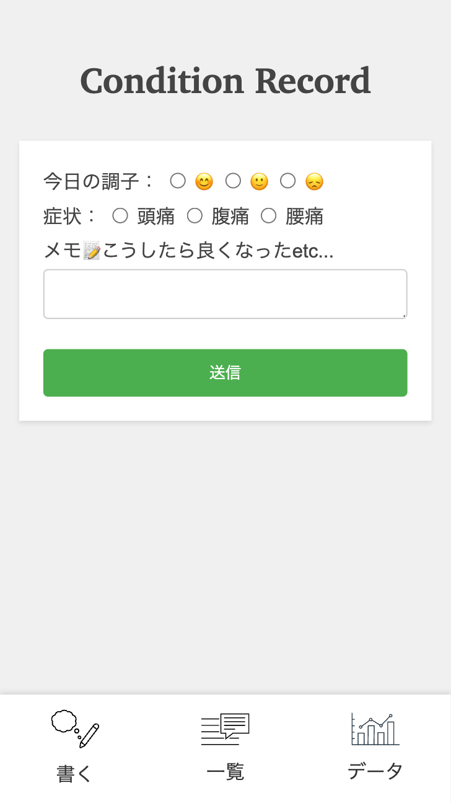

# kadai07-php-basic
PHP1 - アンケートアプリ作成

# ①課題番号-プロダクト名
Conditon Record　日々の体調記録アプリ

## ②課題内容（どんな作品か）
- 日々の体調をつけるとともに、良くなった時のメモを残すことで、自分だけの処方箋になるようなアプリを作りました。

## ③DEMO
https://calthy-design.sakura.ne.jp/kadai07-php-basic/index.php

## ④工夫した点・こだわった点
- スマホアプリ風の見た目になるようにしました。

## ④難しかった点・次回トライしたいこと(又は機能)
- グラフ化が難しくてできなかったので次回やりたいです。
- 症状で検索できるような機能もつけたいです。

## ⑤質問・疑問・感想、シェアしたいこと等なんでも
- [質問] 
- [疑問] 
- [感想] 
- [tips] 
- [参考記事] 

- ### スクリーンショット

